# **Задачі**
## **Задача 1. Базові SELECT**
1. Вивести всіх студентів, які зареєструвалися після 2024‑01‑01.

2. Вивести всі курси категорії `"Data Science"`.
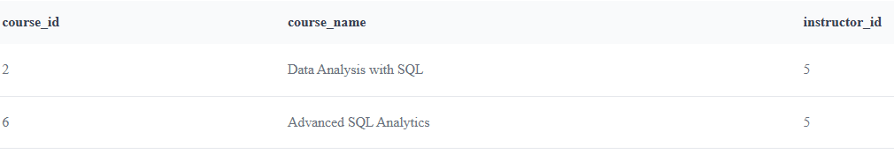
## **Задача 2. Групування та агрегація**
1. Порахувати кількість студентів у кожному місті.
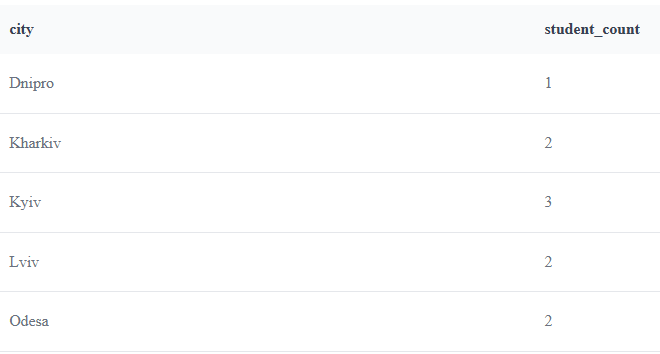
2. Порахувати кількість курсів у кожній категорії.

3. Порахувати середню оцінку по кожному курсу.
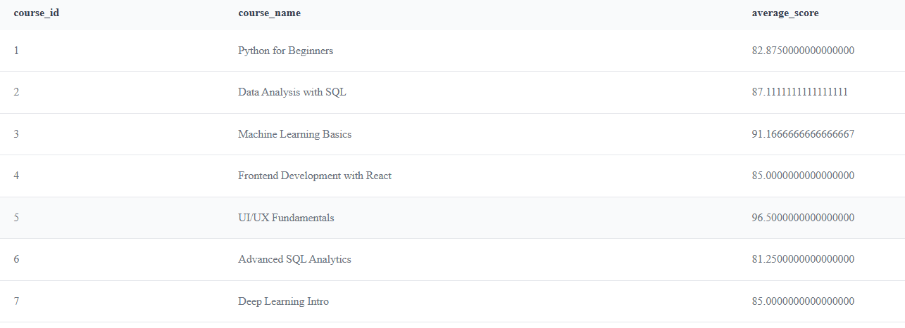
## **Задача 3. JOIN‑аналіз**
1. Вивести список курсів разом з іменами викладачів.
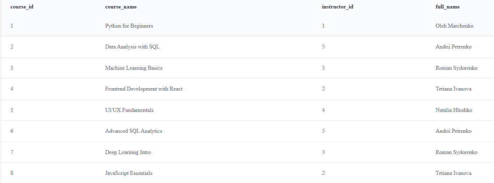
2. Вивести студентів та назви курсів, на які вони записані.
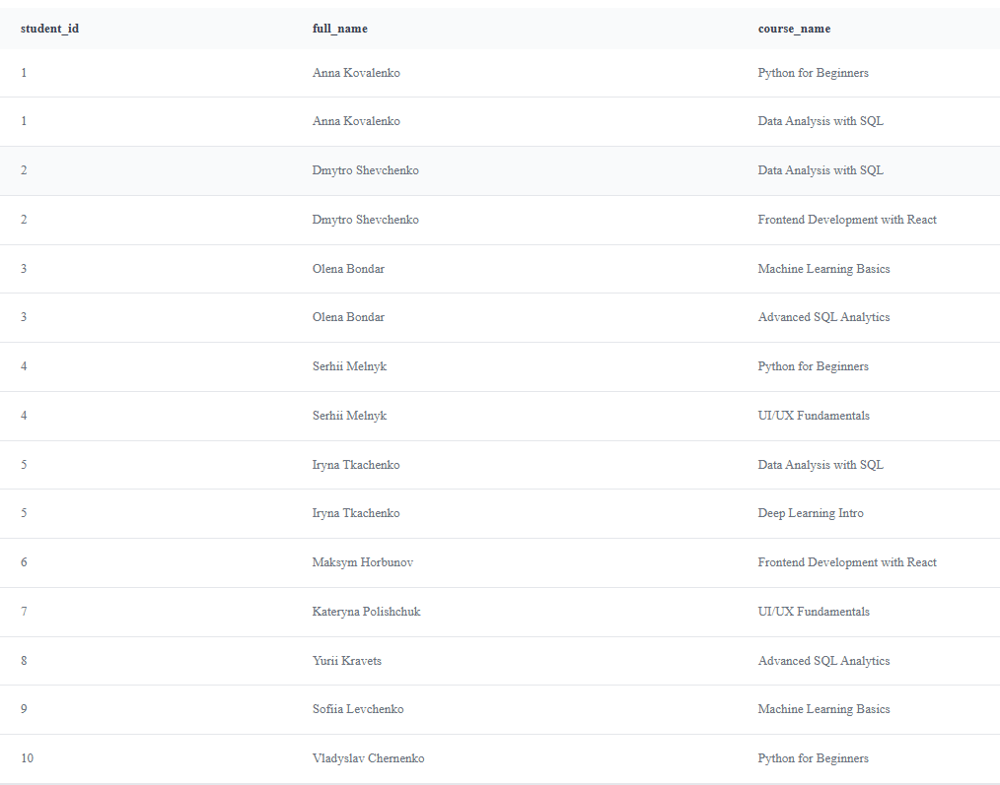
3. Порахувати, скільки студентів у кожного викладача.
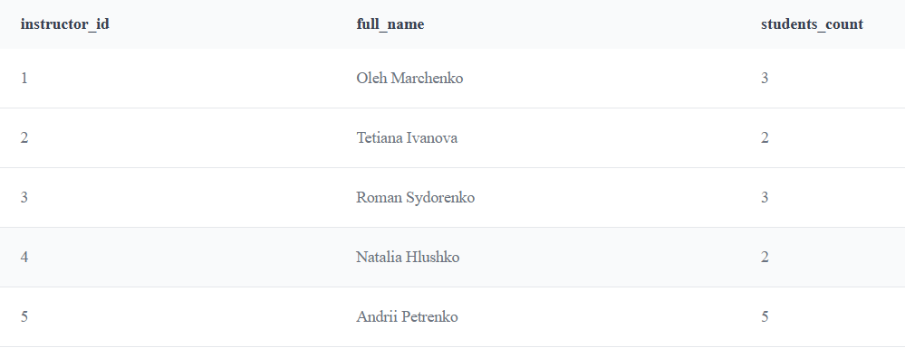
## **Задача 4. Аналітика прогресу**
1. Порахувати середню оцінку кожного студента.
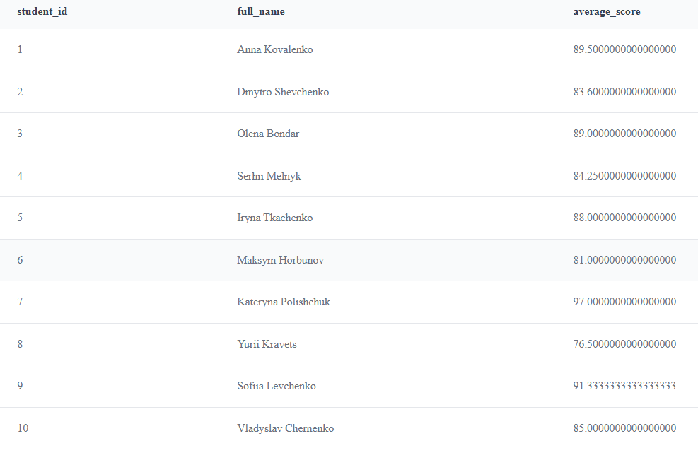
2. Порахувати відсоток завершених уроків для кожного курсу.
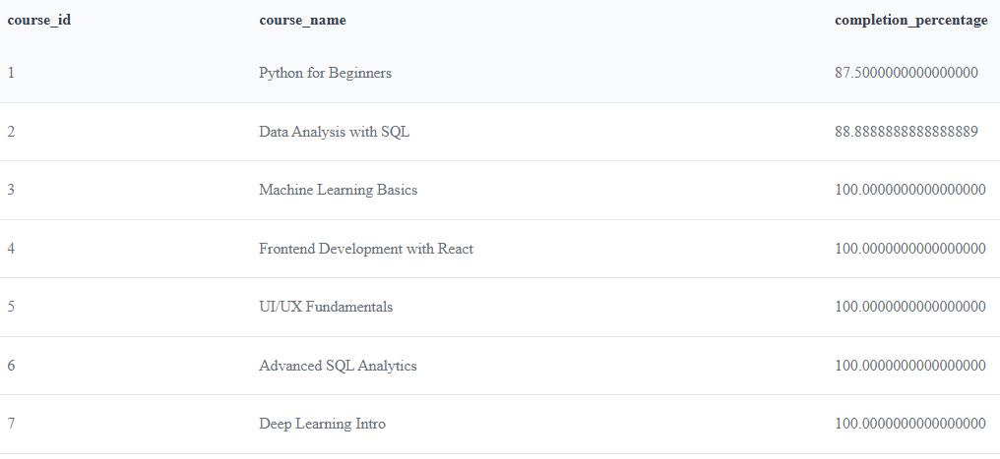
3. Знайти студентів, які завершили всі уроки у своїх курсах.
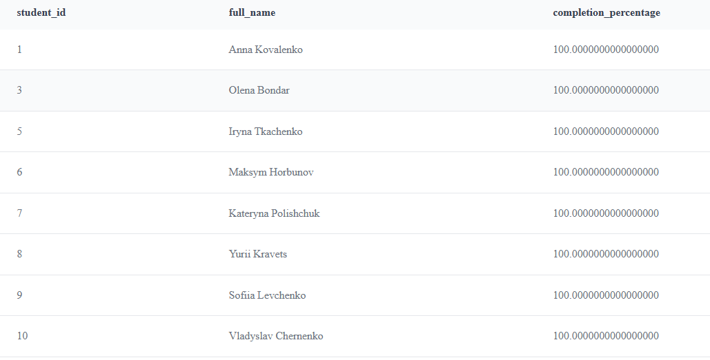

## **Задача 5. Віконні функції**
1. Для кожного курсу визначити рейтинг студентів за середнім балом.
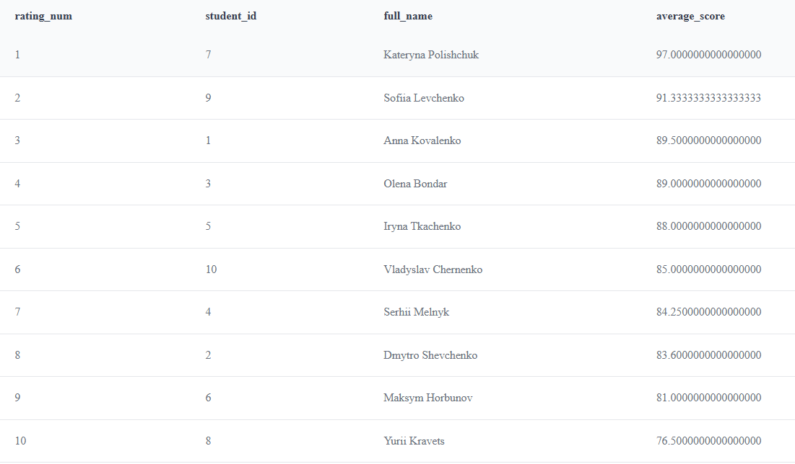
2. Порахувати кумулятивну кількість уроків, завершених студентом у хронологічному порядку.
 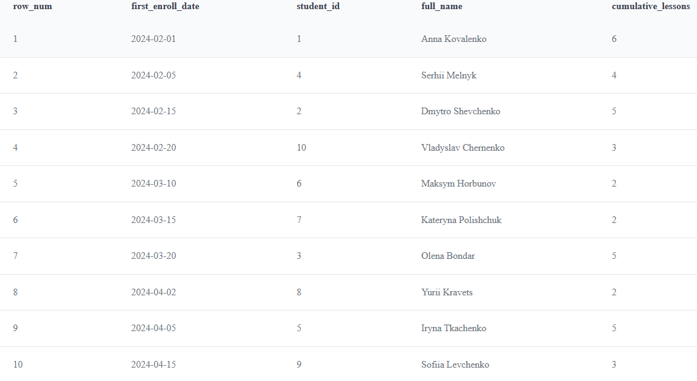
3. Для кожної категорії курсів знайти топ‑1 курс за кількістю студентів.
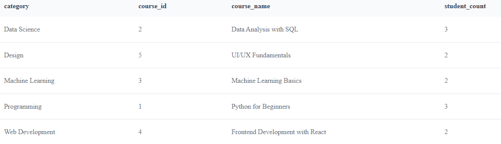
